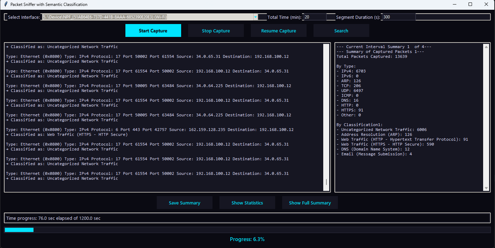
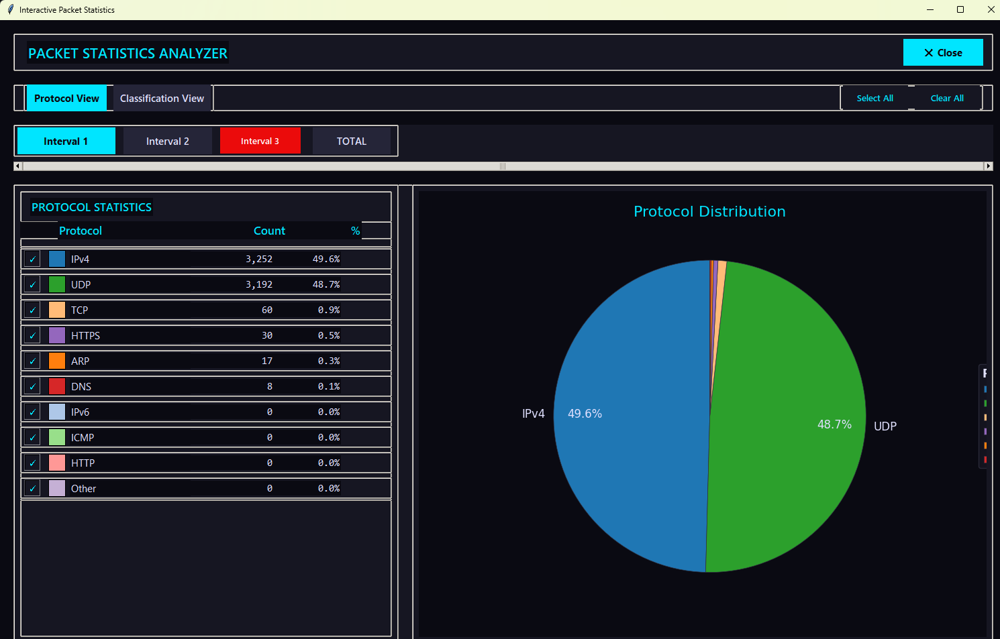
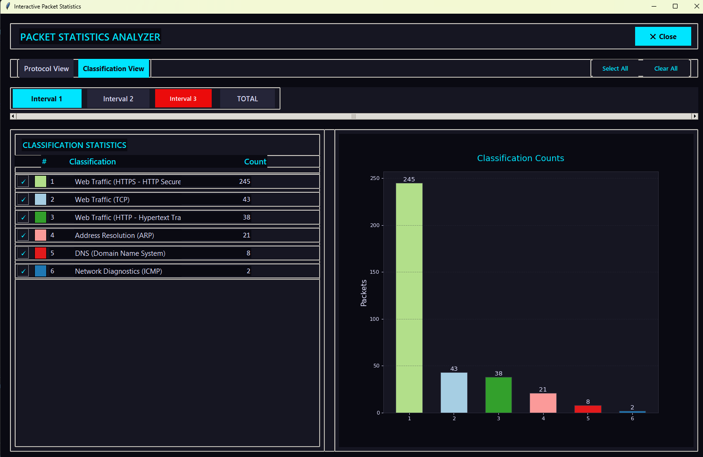
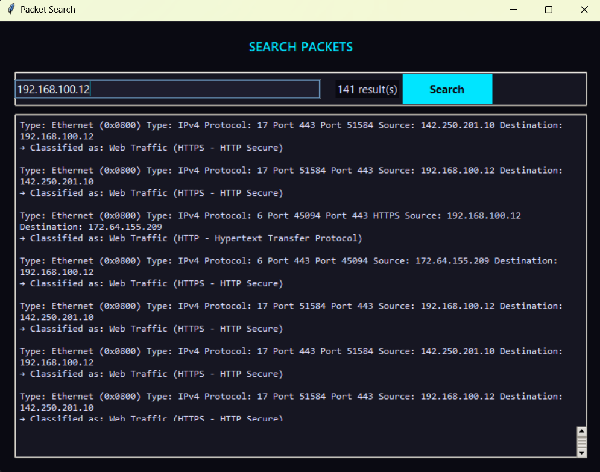

# Network Packet Sniffer and Analyzer

A comprehensive network packet analysis tool with machine learning-based classification and real-time visualization capabilities.

## Features

- **Real-time Packet Capture**: Capture and analyze network packets in real-time
- **Machine Learning Classification**: Automatic packet classification using trained ML models
- **Interactive GUI**: Modern dark-themed interface with interactive charts and statistics
- **Protocol Analysis**: Support for IPv4, IPv6, TCP, UDP, ICMP, DNS, HTTP, HTTPS, ARP
- **Intrusion Detection**: Basic signature-based intrusion detection capabilities
- **Data Visualization**: 
  - Interactive pie charts for protocol distribution
  - Bar charts for classification statistics
  - Real-time updating statistics tables
- **Search Functionality**: Search through captured packets and classifications
- **Export Capabilities**: Save analysis results and packet summaries

## Screenshots

### Main Interface


### Protocol Distribution Analysis


### Classification View


### Search Functionality


## Requirements

- Python 3.7+
- Wireshark/tshark installed on your system
- Required Python packages (see requirements.txt)

## Installation

1. **Clone the repository**
   ```bash
   git clone https://github.com/Arasoul/Network-Packet-Analyzer.git
   cd Network-Packet-Analyzer
   ```

2. **Install Python dependencies**
   ```bash
   pip install -r requirements.txt
   ```

3. **Install Wireshark**
   - Download and install Wireshark from [https://www.wireshark.org/](https://www.wireshark.org/)
   - Make sure `tshark.exe` is accessible in your system PATH, or update the path in the configuration

4. **Download NLTK data** (if not already installed)
   ```python
   import nltk
   nltk.download('punkt')
   ```

## Configuration

Update the tshark path in the main script if needed:
```python
pyshark.tshark.tshark_path = r"path\to\your\tshark.exe"
```

## Usage

1. **Run the application**
   ```bash
   python packet_sniffer_gui.py
   ```

2. **Start packet capture**
   - Select your network interface
   - Click "Start Capture" to begin monitoring
   - Use the GUI controls to view real-time statistics

3. **View Analysis**
   - Switch between Protocol View and Classification View
   - Use interval buttons to analyze specific time periods
   - Search through captured packets
   - Export results for further analysis

## Features in Detail

### Machine Learning Classification
The tool uses a pre-trained machine learning model (`semantic_classifier.pkl`) to classify network traffic patterns. If the ML model is not available, it falls back to rule-based classification.

### Protocol Support
- **Network Layer**: IPv4, IPv6, ARP, ICMP
- **Transport Layer**: TCP, UDP
- **Application Layer**: HTTP, HTTPS, DNS, FTP, SSH, SMTP, and more

### Intrusion Detection
Basic signature-based detection for:
- IP address spoofing
- ARP spoofing attempts
- ICMP flood attacks

### Visualization
- Real-time updating charts and graphs
- Interactive protocol distribution analysis
- Statistical summaries by time intervals
- Color-coded classification results

## Project Structure

```
network-packet-analyzer/
├── packet_sniffer_gui.py          # Main application file
├── semantic_classifier.pkl         # Pre-trained ML model
├── requirements.txt                # Python dependencies
├── README.md                       # Project documentation
├── .gitignore                     # Git ignore rules
└── screenshots/                   # Application screenshots
```

## Contributing

1. Fork the repository
2. Create a feature branch (`git checkout -b feature/new-feature`)
3. Commit your changes (`git commit -am 'Add new feature'`)
4. Push to the branch (`git push origin feature/new-feature`)
5. Create a Pull Request

## License

This project is licensed under the MIT License - see the [LICENSE](LICENSE) file for details.

## Disclaimer

This tool is for educational and authorized network analysis purposes only. Always ensure you have proper authorization before monitoring network traffic. The authors are not responsible for any misuse of this software.

## Troubleshooting

### Common Issues

1. **tshark not found**: Make sure Wireshark is installed and tshark is in your PATH
2. **Permission denied**: Run the application with administrator privileges for packet capture
3. **ML model not loading**: Ensure `semantic_classifier.pkl` is in the same directory as the main script

### System Requirements

- **Windows**: Windows 10 or later
- **Memory**: Minimum 4GB RAM (8GB recommended for large captures)
- **Network**: Administrative privileges required for packet capture

## Acknowledgments

- Built with PyShark for packet capture
- Uses scikit-learn for machine learning classification
- GUI built with tkinter and matplotlib
- NLTK for text processing
